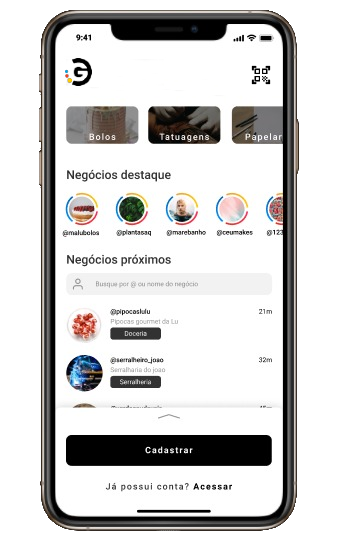

# Elo Go 🚀 em construção... 🚧

<p align="center">
   
</p>


<p align="center">	
  
  

  <a aria-label="Completed" href="https://prensa.li/apicon/hackathon-elo-apicon-2020/">
    </img>
  </a>
  <a href="https://github.com/bkkater/happy/commits/master">
    
  </a> 
  
</p>

# Team Connect
- [Bianca](https://github.com/bkkater)
- [Juliana](https://www.linkedin.com/in/juliana-talita-b683581b2/)
- [Eduarda](https://www.linkedin.com/in/eduarda-barboza-tavares-612a55159/)
- [Jhennifer](https://www.linkedin.com/in/jhennifer-pimentel-0518171b2/)

#### **Descrição**

Pensando no cotidiano do brasileiro fomos atrás de como incluir os pagamentos digitais em compras nos pequenos negócios locais. Para tornar isso possível fizemos pesquisas e descobrimos os problemas que esses negócios encontram ao tentar se inserir nas redes sociais, em principal o Instagram. Sabemos como isso ajuda o negócio a crescer e ser encontrado por mais pessoas. 
Por isso desenvolvemos o Elo go para ser uma forma de conectar esses dois grupos, quem busca clientes e quem busca serviços e produtos próximos. Incluindo nossas soluções de pagamentos digitais dentro da rotina dessas pessoas.

#### **Solução**
O Elo go é um aplicativo que irá conectar pequenos negócios locais aos possíveis clientes próximos que buscam aqueles serviços ou produtos. Nosso aplicativo irá utilizar diversas soluções de pagamento digital, como transferências, boletos e futuramente o PIX. Além disso, integramos nossa plataforma à API Elo que oferece pagamento através de QR Code. Nosso diferencial está na facilidade de gerenciamento dos produtos e serviços, vinculado ao Instagram, a rede mais utilizada para divulgação online, com a API de geolocalização da Here. Unindo esses dois lados será possível aproximar os pagamentos digitais das compras cotidianas dos brasileiros.

## 📥 Layout disponivel em:  
<p align="center">
    <a title=".fig Mobile" href="https://www.figma.com/file/lEZ6yiuNhiQ25BeUtnAyZJ/Hackathon-ELO?node-id=1%3A2/duplicate">
        
    </a>
</p>

### Mobile Screenshot
  
  
# :bulb: **Tecnologias**

<details>
  <summary>Mobile</summary>

-   [React](https://pt-br.reactjs.org/)
-   [React Native](https://reactnative.dev/)
-   [Expo](https://expo.io/learn)
-   [Typescript](https://www.typescriptlang.org/)
-   [React Navigation](https://reactnavigation.org/)
-   [Axios](https://www.npmjs.com/package/axios)
-   [Expo Google Fonts](https://github.com/expo/google-fonts)
-   [React Native Maps](https://github.com/react-native-maps/react-native-maps)
-   [Here Reverse Geocoding API](https://developer.here.com/documentation/geocoding-search-api/dev_guide/topics/endpoint-geocode-brief.html)
-   [VS Code](https://code.visualstudio.com/)
</details>

# :computer:  **APIs utilizadas**

1. Geolocalização Reversa - [**Here**](https://developer.here.com)

# :construction_worker: Como rodar
```bash
# Clone o Repositório
$ git clone https://github.com/apiplaybook/hackathon-apicon-2020-team-connect.git
```
Acesse: http://localhost:3000/ para ver o resultado.

### 📱 Run Mobile Project
Para rodar o projeto mobile você precisa de um celular com o [expo](https://play.google.com/store/apps/details?id=host.exp.exponent) instlado ou um emulador android/ios.

```bash
# Vá para a pasta
$ cd hackathon-apicon-2020-team-connect.git
# Instale as depedencias
$ yarn install
# Rode a aplicação
$ yarn start
```

Depois leia o QRCode com o app do [expo](https://play.google.com/store/apps/details?id=host.exp.exponent) ou rode em um emulador.
